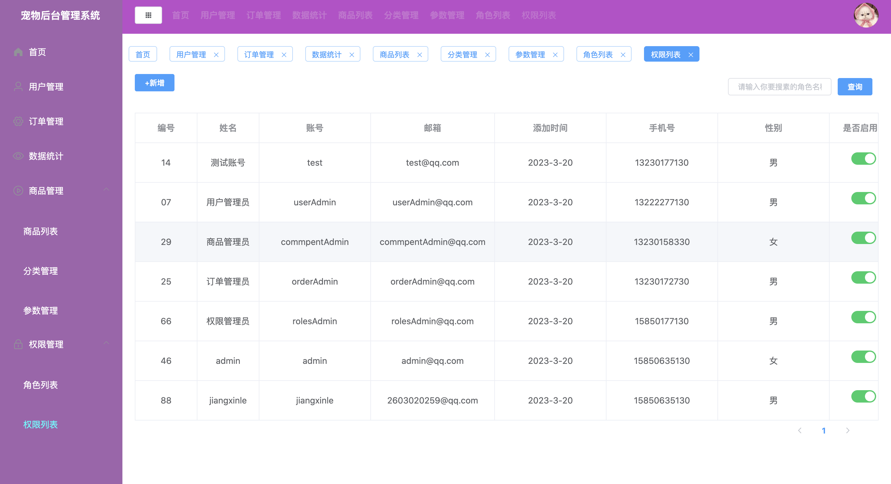
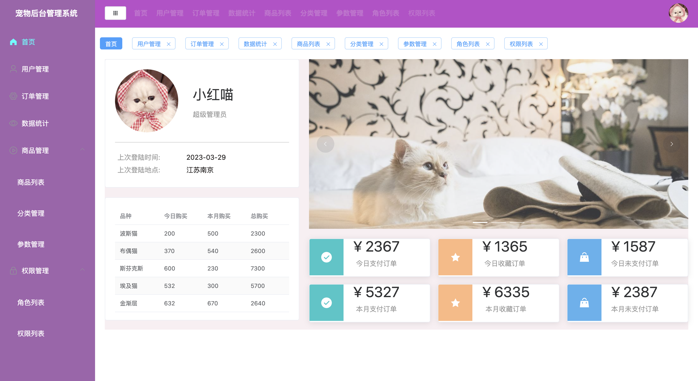
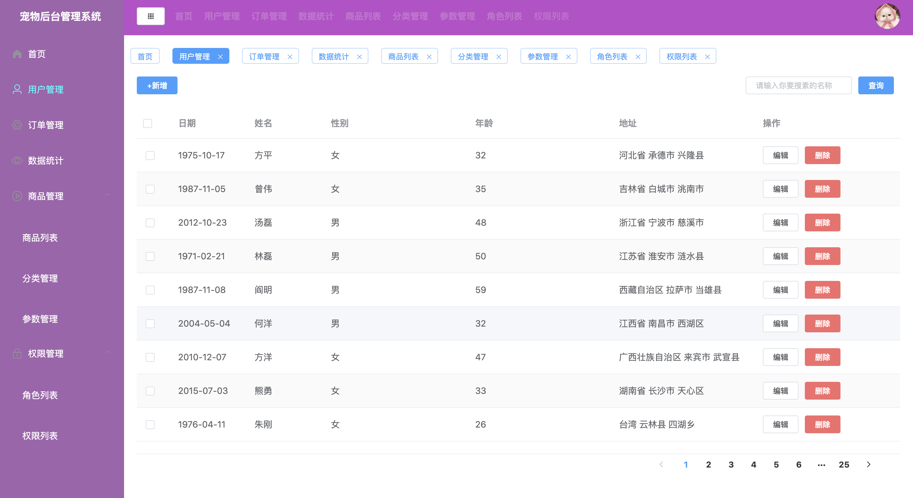
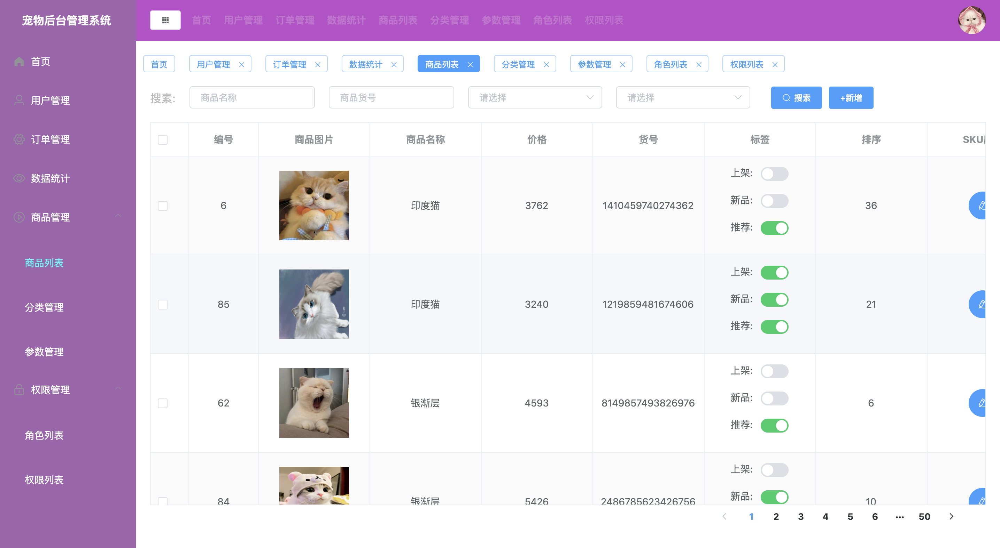
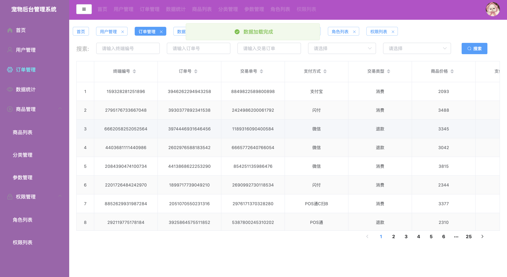
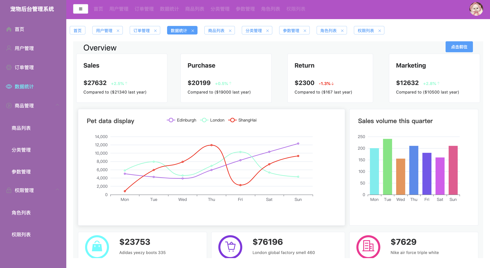
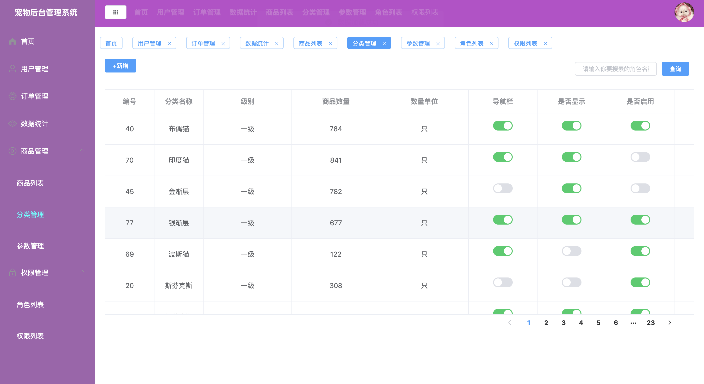

# 基于Vue开发的（星乐猫咖）后台管理系统（PC端）
------------------------

 

## 前言
该项目为前后端分离项目的前端部分（前端的中后台项目）。

## 项目介绍
星乐宠物管理系统，为了方便公司内部业务和数据的管理为内部人员而打造的系统，主要包括：用户管理，商品管理，订单管理，财务管理，数据统计，大屏数据可视化，设置等功能。
## 项目演示
项目在线演示地址：https://jxlscript.gitee.io/vue-admin-jxl/
## 技术栈
html(5) + css(3) + Javascrip + Vue + vuex + vue-router + vue-cli + ES6/7/8 + axios + elementUI + node + less + bootstrap + mock + cookie + Echarts
## 说明
>  本项目主要用于熟悉如何用 vue 架构一个后端管理平台项目

>  如果对您有帮助，您可以点右上角 "Star" 支持一下 谢谢！ ^_^

>  或者您可以 "follow" 一下，我会不断开源更多的有趣的项目

>  开发环境 MacBook Pro  Chrome 

>  如有问题请直接在 Issues 中提，或者您发现问题并有非常好的解决方案，欢迎 PR 👍

>当你学到这里的时候，恭喜你可以熟练运用Javascript这门语言了，希望在以后的生活里，更加热爱，更加努力。 ^_^

## 项目结构
------------------------

```bash
├── /public/          # 项目网页和项目图标
│ ├── /static/          # 大屏数据可视化
│ ├── /favicon.ico/          # 项目图标
│ ├── /index.html/          # 页面入口
├── /static/         # 项目非组件静态资源
├── /src/            # 源码目录
│ ├── /api/          # 请求
│ ├── /assets/       # 组件静态资源(图片)
│ ├── /components/   # 公共组件
| ├── /mixin/          # 混入文件
│ ├── /router/       # 路由配置
│ ├── /store/         # vuex状态管理
│ ├── /views/        # 路由组件(页面维度)
│ ├── /mock/       # 模拟数据
│ ├── /utils/        # axios的二次封装
│ ├── /App.vue/        # 组件入口
│ ├── /main.js/        # 项目入口        
├── .babelrc         # ES6语法编译配置
├── .gitignore       # git忽略文件
├── package.json     # 项目依赖
└── README.md        # 项目文档
```
## 完成功能
- [x] 登录 -- 完成
- [x] 路由拦截 -- 完成
- [x] 全局路由守卫 -- 完成
- [x] 动态路由 -- 完成
- [x] 用户管理（增加、编辑、搜索、删除、数据权限、刷新缓存） -- 完成
- [x] 交易订单（增加、编辑、搜索、删除） -- 完成
- [x] 数据统计（增加、编辑、搜索、删除、大屏数据可视化跳转） -- 完成
- [x] 角色管理（增加、编辑、搜索、删除、权限管理） -- 完成
- [x] 商品管理【商品列表】（增加、编辑、搜索、删除） -- 完成
- [x] 商品管理【分类管理】（增加、编辑、搜索、删除） -- 完成
- [x] 商品管理【参数管理】（增加、编辑、搜索、删除） -- 完成
- [x] 权限管理【角色列表】（增加、编辑、搜索、删除、配置权限） -- 完成
- [x] 权限管理【权限列表】（增加、编辑、搜索、删除、配置权限） -- 完成
## 部分项目截图
权限列表


首页


用户管理


商品列表


订单管理


数据统计


分类管理

## 运行项目
------------------------

``` bash
# install dependencies
npm install

# serve with hot reload at localhost:8080
npm run serve

# build for production with minification
npm run build

# build for production and view the bundle analyzer report
npm run build --report

# run unit tests
npm run unit

# run e2e tests
npm run e2e

# run all tests
npm test


```
## 技术交流和分享
邮箱：2603020259@qq.com


